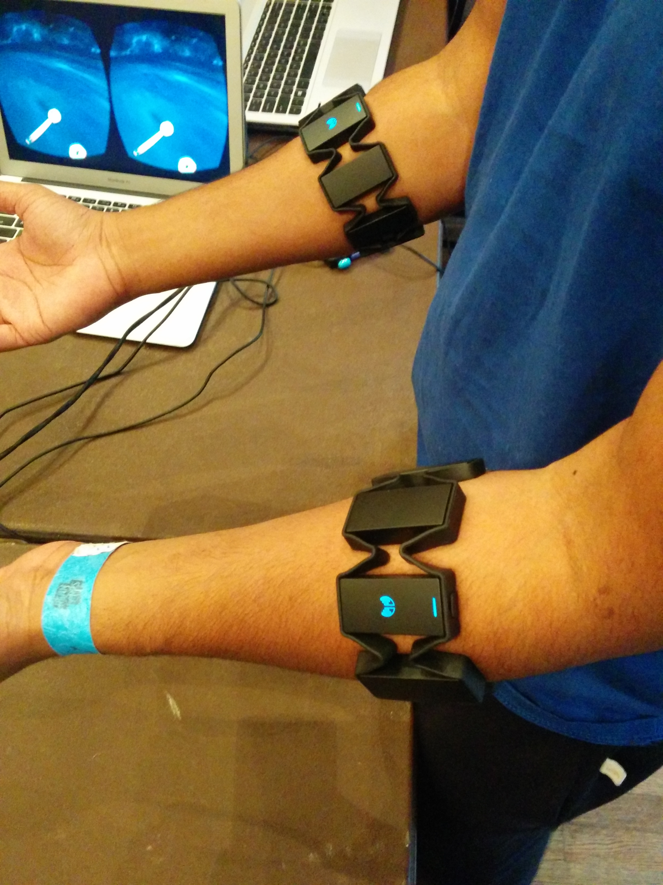
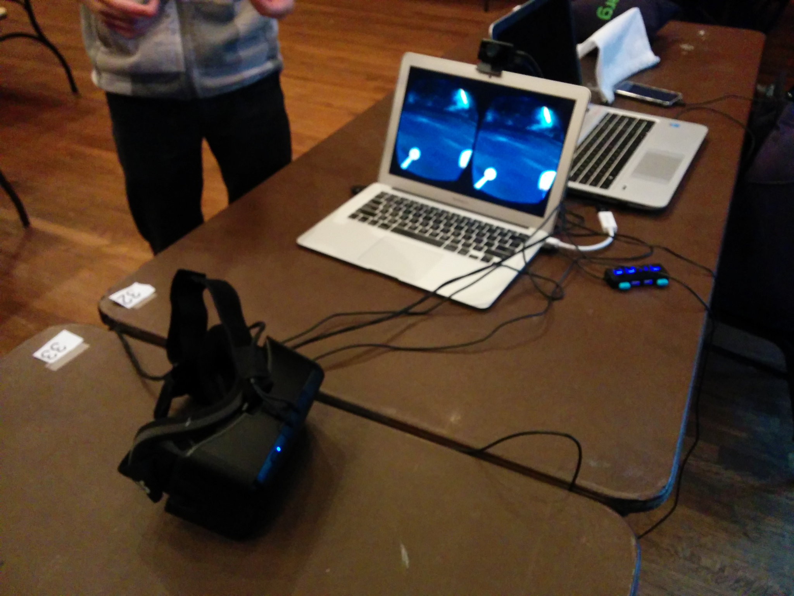

# 🦾 IronMan Hand Simulator: A Heroic Aid for Children with Autism  

**About the Project**  
Inspired by the ingenuity of Tony Stark, this project transforms the fantasy of an Iron Man suit into a **real-world assistive tool**. The *IronMan Hand Simulator* is designed to support children with autism by combining **playful interaction** with **therapeutic benefits**, making learning and engagement feel heroic.  

**Mission Statement**  
Our goal is to create a **supportive, fun, and inclusive technology** that empowers children with autism. By blending **engineering, simulation, and empathy**, the project seeks to give kids not just a helping hand—but a *superhero’s hand*.  

---

## 📸 Project Snapshots  

👉 [Click here to open to view codes](./QUANT%20PORTFOLIO/)  

  
    
    

  

---

## ✨ Features  

- **🦾 Heroic Hand Simulation** – A hand movement simulator inspired by Iron Man, designed to make interaction engaging and motivating for children.  
- **🎮 Gamified Therapy** – Turns repetitive therapeutic tasks into playful challenges, keeping children focused and excited.  
- **🤝 Autism-Friendly Design** – Developed with simplicity, sensory considerations, and accessibility in mind.  
- **⚡ Gesture Recognition** – Uses motion-based interaction to respond to children’s actions, improving motor skills and coordination.  
- **🌍 Inclusive Impact** – Blends technology, compassion, and creativity to support children with autism worldwide.  

---

## ⚙️ How It Works  

1. **🖐 Input: Gesture & Movement**  
   - The child interacts with the simulator using simple hand gestures or pre-set movement controls.  

2. **💻 Processing: Iron Man Simulation Engine**  
   - Movements are captured and processed through the simulator’s logic (gesture recognition, motor response, or code-based triggers).  
   - Built-in filters smooth the motion so it feels natural and engaging.  

3. **🎨 Output: Interactive Iron Man Hand**  
   - The simulator responds visually and/or physically, mimicking Iron Man’s hand functions (movement, lights, or feedback).  
   - Immediate feedback keeps children engaged and encourages repetition (important for therapy).  

4. **🌱 Learning & Support**  
   - Repetition builds **motor coordination, focus, and confidence**.  
   - Turns therapy-like practice into a fun “superhero experience.”  

---

## 🚀 Future Improvements  

- **VR/AR Integration** – Immersive Iron Man environment for deeper engagement.  
- **AI Personalization** – Adaptive difficulty levels for each child’s progress.  
- **Wearable Prototype** – Lightweight glove or exoskeleton version for real-life practice.  
- **Community Collaboration** – Open-source contributions from developers, therapists, and educators.  

---
