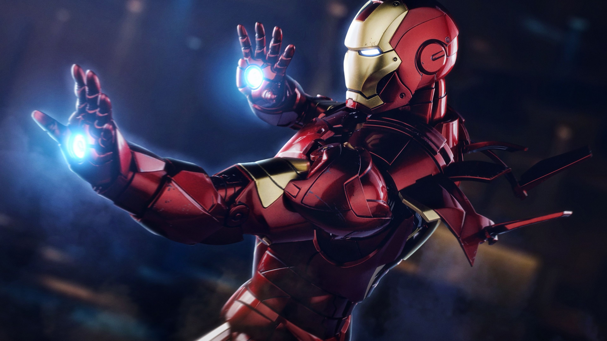

# 🦾 Iron Man Hand Simulator — Hospital Edition



A playful, therapeutic **hand-tracking repulsor simulator** inspired by Iron Man.  
Built to bring joy to **autistic and disabled children** through gesture‑controlled, on‑screen interactions.  

---

## 🎮 What it does
- Recognizes hand/arm gestures (via **Myo armband**, optional mouse fallback).
- Fires a **repulsor beam** that pops floating targets with light + sound feedback.
- Tracks **score, streaks, and session time** for short, focused play.
- Runs on a laptop/monitor or a VR headset for immersion.

 

---

## 🏥 Field Use
Deployed during hospital visits: kids used simple **open palm to “charge”** and **flick to fire**.  
We observed improved **engagement, smiles, and longer attention windows**.  
Session design: **3–5 minutes**, easy pause/stop, and big UI fonts.

---

## 🧩 Tech
- **Python 3.10+**, **Pygame**, **OpenCV (optional)**  
- Optional **Myo SDK** for EMG/IMU gestures  
- Designed so Myo can be swapped for **camera‑based** or **keyboard** control

---

## 🚀 Quick Start
```bash
pip install pygame opencv-python
python repulsor_game.py         # run the playable version
```
> If you have a Myo armband, see `myo_integration.py` for hooking gestures into the game.

---

## 📂 Repo Layout
- `repulsor_game.py` — full “targets + scoring + sounds” experience
- `simulator_core.py` — minimal repulsor demo
- `myo_integration.py` — stub/example for integrating Myo gestures
- `assets/` — sound + simple sprite
- `images/` — readme visuals

---

## 🔊 Accessibility & Safety
- Nonviolent, non‑competitive framing (“pop the lights!”)  
- Volume‑limited sounds, adjustable brightness  
- Big pause button; **Esc** to exit immediately

---

## ❤️ Why this matters
For a child in long hospital stays, **joy is medicine**. This project turns STEM into a moment of **agency and delight**.

---

## 📜 License
MIT — use and adapt freely for education and care settings.
